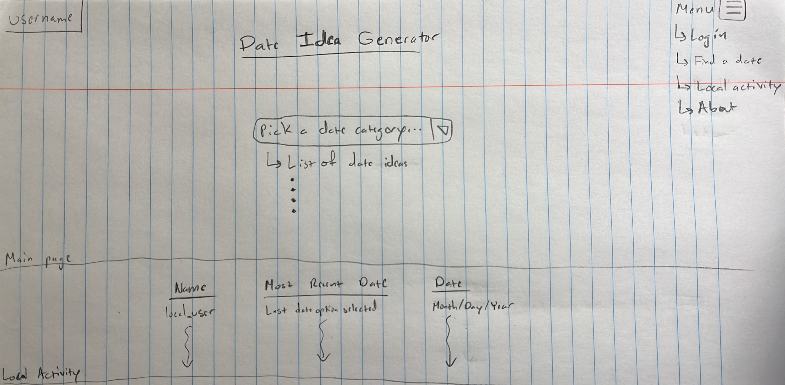

# Date Idea Generator

This is an application that is developed for the BYU CS 260 course.

### Link to web server: [startup](dates4you.click)

## Specification Deliverable

These are the specs for my startup to deliver on 1/17/23

### Elevator Pitch

Have you and your special someone ever wanted to go on a date but not known what to do? Have you ever wished you had a tool that could help you find a date and see what's popular? The Date Idea Generator is here to help! It allows you to select a date category and see a list of possible dates to go on that will allow you to form treasured memories with your special someone. The Date Idea Generator also lets you see what dates other locals are going on so that you can see what's popular and then try it out yourself! Come use the Date Idea Generator and make your quality time better than it ever has been before.

### Key Features
- Secure login over HTTPS
- Ability to select a date category
- Ability to select a date from a date category, change the selected date if desired, and then commit to a date
- Ability to view the local activity of what dates other users have gone on and when they went on that date

### Description of how each technology will be used
- HTML: Use HTML strucutre for application such that application will be easy to use. Will have 4 HTML pages, one for login, one for picking a date, one for checking local activity, and one for learning about the application.
- CSS: Use to style the application so that it will be aesthetically pleasing, such as good usage of colors, white space, and button design. 
- JavaScript: Enable ability to press buttons and access different parts of the application.
- Web service: Save the last date a user committed to
- Athentication: Enable ability for users to create an account and log in to the application
- Database persistence: Store login information as well as the last date user committed to and the date they committed to it
- Websocket: Display the last date you committed to and when in the local activity page so others can see the name of the date and when you committed to it
- Web framework: Using React to add components and request routing

### Rough sketch

### HTML Deliverable:
- I made 4 html files for each page of my startup
- 